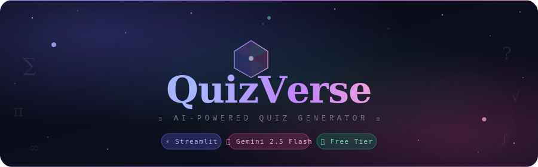

<p align="center">
  
</p>

<p align="center">
  <a href="https://quizoverse-uenwqd4cvpnxnzzjigpvx4.streamlit.app/">
    
  </a>
  
  
  
</p>

---

## 🔮 What is QuizVerse?

**QuizVerse** is an AI-powered quiz generator that creates a 10-question multiple choice quiz on **any topic you can think of** — instantly. Powered by Google's Gemini 2.5 Flash and built with Streamlit, it runs beautifully in the browser with zero setup for the user.

---

## ✨ Features

- 🧠 **AI-Generated Questions** — Gemini 2.5 Flash generates unique, well-formatted questions every time
- 🎯 **Any Topic** — History, Science, Pop Culture, Programming, Math — anything goes
- 📊 **Live Scoring** — Get instant feedback per question with a final score summary
- 🔢 **Question Navigator** — Jump between questions freely; answered ones show a ✓
- 🏆 **Results Screen** — Animated SVG score ring with performance feedback
- 🌌 **Space UI** — Deep cosmic theme with aurora glows, twinkling stars, and glassmorphism cards

---

## 🚀 Live Demo

👉 **[Try QuizVerse now](https://quizoverse-uenwqd4cvpnxnzzjigpvx4.streamlit.app/)**

---

## 🛠️ Tech Stack

| Layer | Technology |
|-------|-----------|
| Frontend | Streamlit + custom CSS |
| AI Model | Google Gemini 2.5 Flash |
| Language | Python 3.13 |
| Deployment | Streamlit Community Cloud |

---

## ⚙️ Run Locally

**1. Clone the repo**
```bash
git clone https://github.com/soumyajyoti2005/Quiz-Genarator.git
cd Quiz-Genarator
```

**2. Install dependencies**
```bash
pip install -r requirements.txt
```

**3. Add your API key**

Create a `.env` file:
```
API_KEY=your_gemini_api_key_here
```
Get a free key at [aistudio.google.com](https://aistudio.google.com)

**4. Run the app**
```bash
streamlit run main.py
```

---

## 📁 Project Structure

```
Quiz-Genarator/
├── main.py            # Main Streamlit app
├── requirements.txt   # Dependencies
├── banner.svg         # README banner
└── .gitignore         # Excludes .env
```

---

## 📦 Requirements

```
streamlit
google-genai
python-dotenv
```

---

<p align="center">
  Made with 🔮 by <a href="https://github.com/soumyajyoti2005">soumyajyoti2005</a>
</p>
